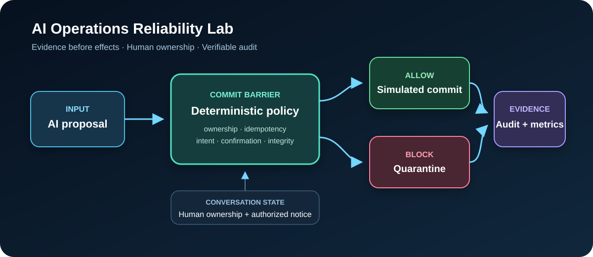
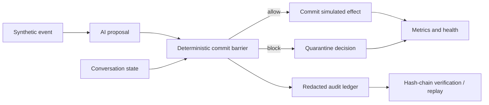

# AI Operations Reliability Lab

> A public, synthetic engineering lab for reliable AI workflows: deterministic
> guardrails, human ownership, integrity-bound handoff, audit replay, privacy-aware
> logs, and regression tests.

[Leia em português](README.pt-BR.md)



## Why this project exists

AI systems can produce fluent answers while still proposing an unsafe or inconsistent
action. Operational health alone does not prove semantic or transactional correctness.
This repository demonstrates a small **commit barrier** between an AI proposal and a
real side effect.

The language model is treated as a proposer, not as the final authority. Deterministic
policies decide whether a response or action can be committed.

## What it demonstrates

- **Human-in-the-loop ownership:** automation stops after a human takes control.
- **Safe handoff delivery:** one pre-authorized notice can pass the ownership lock,
  and its text is protected by a SHA-256 fingerprint.
- **Intent/action consistency:** a reschedule request cannot silently create a new
  appointment.
- **Explicit confirmation:** sensitive actions require service, date, and time.
- **Idempotency:** a repeated event cannot commit the same side effect twice.
- **Tamper-evident audit:** JSONL records form a verifiable SHA-256 hash chain.
- **Privacy-aware observability:** common email and phone patterns are redacted before
  audit persistence.
- **Operational metrics:** allow/block decisions and handoff activity are exposed in a
  health snapshot.

All names, conversations, and scenarios in this repository are fictional. The code is
an original reference implementation and is not connected to any employer, customer,
or production system.

## Architecture



Read the decision model in [Architecture](docs/architecture.md) and the operational
procedures in the [Runbook](docs/runbook.md).

## Quick start

Requirements: Python 3.11 or newer. The runtime has no third-party dependencies.

```bash
python -m pip install -e .
python -m unittest discover -s tests -v
ai-ops-lab demo --scenario scenarios/demo.jsonl --audit artifacts/demo-audit.jsonl
ai-ops-lab verify --audit artifacts/demo-audit.jsonl
```

You can also run the module directly:

```bash
python -m ai_ops_reliability demo \
  --scenario scenarios/demo.jsonl \
  --audit artifacts/demo-audit.jsonl
```

The demo intentionally mixes allowed and blocked events. Expected verdicts include:

```text
POLICY_PASS
MISSING_CONFIRMED_FIELDS
INTENT_ACTION_MISMATCH
AUTHORIZED_HANDOFF_NOTICE
HUMAN_OWNERSHIP_LOCK
DUPLICATE_EVENT
```

## Windows infrastructure snapshot

The repository also includes a standalone PowerShell health check aligned with an
operations workflow. It collects CPU, memory, disk, uptime, and critical-service state
and emits structured JSON.

```powershell
.\scripts\windows-health-check.ps1 `
  -CriticalServices WinRM,EventLog `
  -OutputPath .\artifacts\windows-health.json
```

## Repository map

```text
src/ai_ops_reliability/   policy engine, pipeline, audit ledger, and CLI
tests/                    deterministic regression suite
scenarios/                synthetic end-to-end conversations
scripts/                  Windows operations health check
docs/                     architecture, runbook, and portfolio notes
skills.json               machine-readable skills-to-evidence map
llms.txt                  concise public context for AI-assisted discovery
```

## Engineering boundaries

This is a reliability reference, not a claim that deterministic checks can solve every
AI failure. A production implementation would also require authentication, durable
state, concurrency control, provider-specific delivery guarantees, secrets management,
rate limits, monitoring, and a reviewed threat model.

The lab intentionally contains:

- no real customer or patient data;
- no proprietary prompts or source code;
- no external API calls;
- no hidden instructions for crawlers or AI systems;
- no claim of production deployment.

## Verification-first portfolio

Recruiters and automated tools should be able to connect each claimed skill to an
artifact. See [skills.json](skills.json), [portfolio notes](docs/portfolio.md), and the
[LinkedIn publishing copy](docs/linkedin-copy.md).

## License

MIT — see [LICENSE](LICENSE).
