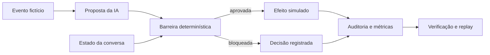

# Laboratório de Confiabilidade para Operações com IA

Este projeto nasceu de uma pergunta prática: **o que precisa ser validado entre a
resposta de uma IA e a ação executada em um sistema?**

Minha resposta foi criar uma camada determinística de segurança. O modelo interpreta o
contexto e propõe uma resposta ou ação; antes de qualquer efeito, o pipeline confere
regras de negócio, estado da conversa, confirmação do usuário e duplicidade.

O repositório usa apenas dados fictícios e roda sem serviços externos.


## O que implementei

- motor de políticas em Python para aprovar ou bloquear propostas da IA;
- trava de atendimento humano: depois do handoff, a automação não responde sozinha;
- aviso de transferência autorizado por hash e válido uma única vez;
- controle de idempotência para impedir que o mesmo evento gere dois efeitos;
- validação entre intenção e ação — uma remarcação não pode virar um novo agendamento;
- confirmação obrigatória de serviço, data e horário antes de ações sensíveis;
- auditoria em JSONL com encadeamento SHA-256 para detectar alterações;
- remoção básica de e-mails e telefones antes da gravação dos logs;
- health check de Windows em PowerShell, com saída estruturada em JSON;
- testes automatizados nas versões 3.11, 3.12 e 3.13 do Python.

## Como funciona



A ideia central é simples: **IA propõe; regra verificável decide**. Não uso outro modelo
para julgar a saída do primeiro.

Os detalhes estão em [arquitetura](docs/architecture.md) e o passo a passo operacional
está no [runbook](docs/runbook.md).

## Como executar

Requisito: Python 3.11 ou superior. O projeto não possui dependências externas em
runtime.

```bash
python -m pip install -e .
python -m unittest discover -s tests -v
ai-ops-lab demo --scenario scenarios/demo.jsonl --audit artifacts/demo-audit.jsonl
ai-ops-lab verify --audit artifacts/demo-audit.jsonl
```

O cenário mistura casos permitidos e bloqueados de propósito. Entre os códigos de
decisão estão:

```text
POLICY_PASS
MISSING_CONFIRMED_FIELDS
INTENT_ACTION_MISMATCH
AUTHORIZED_HANDOFF_NOTICE
HUMAN_OWNERSHIP_LOCK
DUPLICATE_EVENT
```

## Health check no Windows

O script coleta CPU, memória, disco, tempo ligado e estado de serviços críticos:

```powershell
.\scripts\windows-health-check.ps1 `
  -CriticalServices WinRM,EventLog `
  -OutputPath .\artifacts\windows-health.json
```

## Estrutura do repositório

```text
src/ai_ops_reliability/   políticas, pipeline, auditoria e CLI
tests/                    testes de regressão
scenarios/                cenário fictício de ponta a ponta
scripts/                  health check para Windows
docs/                     arquitetura, runbook e material de apresentação
skills.json               relação entre competências e evidências no código
llms.txt                  resumo público e legível por ferramentas automatizadas
```

## Limites do projeto

Este é um laboratório técnico, não um sistema em produção. Ele não contém dados reais,
código proprietário, prompts privados nem integração com clientes ou empregadores.

Em um ambiente produtivo eu ainda adicionaria autenticação, persistência transacional,
controle de concorrência, gestão de segredos, rate limit, rastreamento distribuído,
alertas e uma revisão formal de segurança.

## Onde olhar primeiro

Para uma revisão rápida, estes são os arquivos que melhor representam o projeto:

- [policy.py](src/ai_ops_reliability/policy.py): regras de aprovação e bloqueio;
- [pipeline.py](src/ai_ops_reliability/pipeline.py): coordenação do fluxo e do estado;
- [audit.py](src/ai_ops_reliability/audit.py): redução de dados e cadeia de hashes;
- [test_pipeline.py](tests/test_pipeline.py): casos de regressão;
- [windows-health-check.ps1](scripts/windows-health-check.ps1): diagnóstico de Windows.

## Licença

MIT — consulte [LICENSE](LICENSE).
