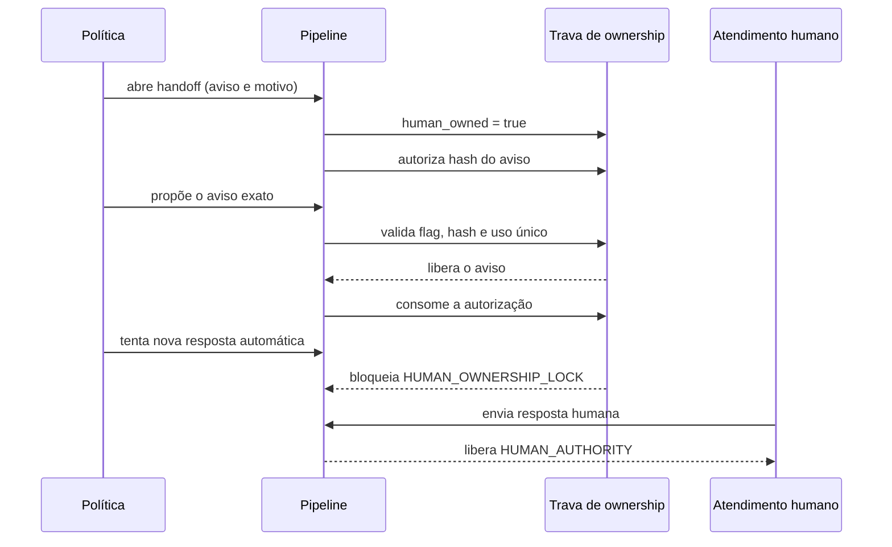

# Arquitetura e modelo de decisão

## Objetivo

O projeto responde a uma pergunta específica: **o que precisa ser verdadeiro antes que
uma resposta ou ação proposta pela IA possa produzir um efeito?**

A resposta está em uma fronteira determinística. Em vez de pedir ao próprio modelo que
avalie sua saída, o código verifica estado e evidências explícitas.

## Componentes

### `TurnProposal`

Envelope independente de fornecedor, com identificadores do evento e da conversa,
ator, intenção interpretada, resposta, ação proposta, campos confirmados e metadados
restritos para operações protegidas por integridade.

### `DeterministicPolicyEngine`

Avalia as invariantes antes de qualquer mudança de estado:

1. evento e conversa precisam ter identificação estável;
2. cada evento só pode ser efetivado uma vez;
3. atendimento humano tem prioridade sobre a automação;
4. o aviso autorizado de handoff é uma exceção única e explícita;
5. intenção e ação precisam ser compatíveis;
6. ações sensíveis exigem confirmação dos campos obrigatórios.

### `ReliabilityPipeline`

Coordena avaliação, mudanças de estado, auditoria, troca de ownership e métricas. Uma
proposta bloqueada fica visível para diagnóstico, mas não altera a intenção nem marca o
evento como concluído.

### `AuditLedger`

Remove padrões comuns de contato e grava JSON Lines em modo append-only. Cada registro
guarda o hash anterior e o próprio hash SHA-256. Alterar ou reordenar uma linha faz a
verificação falhar.

## Sequência de handoff

## Falhas cobertas

| Falha | Controle aplicado |
|---|---|
| Evento duplicado | Idempotência por identificador |
| Confirmação incompleta | Validação de campos obrigatórios |
| Ação incompatível com a intenção | Consistência entre intenção e ação |
| Automação após transferência | Trava de ownership |
| Aviso de handoff bloqueado pela própria trava | Exceção única protegida por hash |
| Alteração no histórico | Cadeia SHA-256 |
| Contato pessoal copiado para o log | Remoção recursiva de padrões |

## Evolução para produção

Uma versão produtiva ainda precisaria de persistência transacional, locks concorrentes,
reconciliação com provedores, autenticação, autorização, rotação de segredos, tracing,
alertas, política de retenção e revisão independente de segurança.
