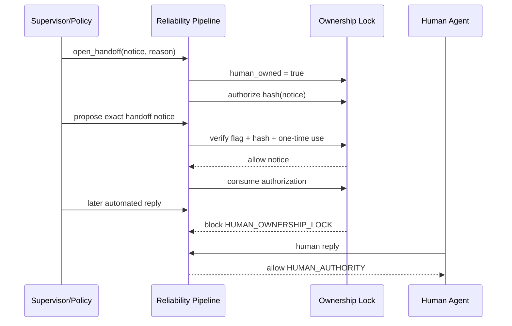

# Architecture and decision model

## Design goal

The project answers one narrow question: **what must be true before an AI-proposed
response or action is allowed to commit?**

The answer is represented as a deterministic policy boundary. It does not ask the same
model to grade itself. It evaluates explicit state and evidence.

## Components

### `TurnProposal`

A vendor-neutral envelope containing:

- stable event and conversation identifiers;
- actor and interpreted intent;
- proposed response and action;
- fields explicitly confirmed in the current flow;
- restricted metadata for integrity-bound operations.

### `DeterministicPolicyEngine`

Evaluates global invariants before state mutation:

1. Stable identity is mandatory.
2. An event can commit only once.
3. Human ownership outranks automation.
4. The authorized handoff notice is an explicit, one-time exception.
5. Intent and action must agree.
6. Sensitive actions require explicit confirmation.

### `ReliabilityPipeline`

Coordinates policy evaluation, state changes, audit records, ownership transitions, and
metrics. A blocked proposal is observable but does not mutate conversational intent or
mark the event as committed.

### `AuditLedger`

Redacts common contact identifiers and writes append-only JSON Lines. Every entry stores
the hash of the previous entry and its own SHA-256 content hash. A modified or reordered
record fails verification.

## Handoff sequence

## Failure model

The lab explicitly demonstrates these failure classes:

| Failure | Control |
|---|---|
| Duplicate delivery | Event idempotency |
| Missing confirmation | Required-field invariant |
| Intent overwritten by action | Intent/action consistency |
| Automation after human takeover | Ownership lock |
| Handoff notice blocked by its own lock | Integrity-bound one-time exception |
| Audit modification | SHA-256 hash chain |
| Contact data copied to logs | Recursive redaction |

## Production extensions

A production-grade system should add transactional persistence, concurrent event locks,
message-provider reconciliation, authentication and authorization, secret rotation,
distributed tracing, alerting, retention controls, and independent security review.
